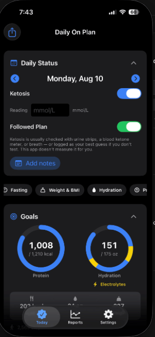
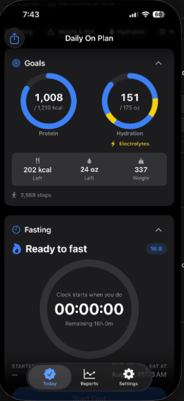
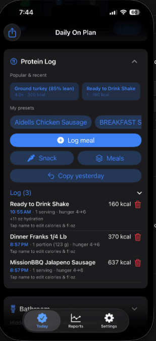
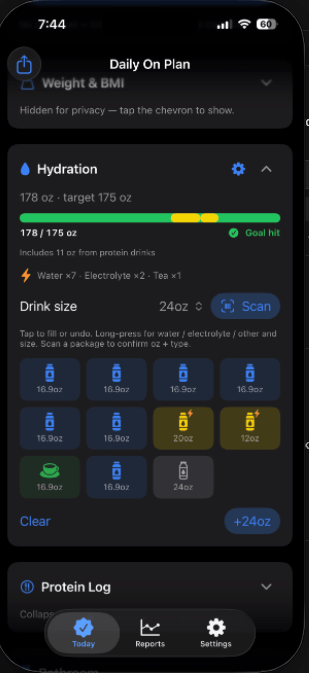
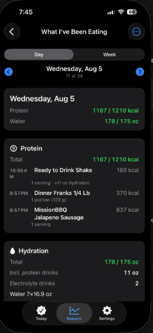

# Daily On Plan

**Stay on plan. One day at a time.**

A personal daily nutrition sheet for iPhone, Apple Watch, and Mac. Protein toward a goal, hydration, followed-plan, optional fasting — on-device, no account, no backend.

This is **not** a medical device. It does not diagnose ketosis, BMI, or anything else.

<p align="center">
  
  
  
</p>

<p align="center">
  
  
</p>

## What it does

- Daily sheet: protein kcal vs goal, followed-plan, ketosis self-report, meals, checklists
- Hydration (bottle grid, electrolytes), optional fasting window
- Weight & BMI (collapsible), workouts, feelings, optional smoking / drinking / bathroom / supplements
- Saved meals, local food catalog, Open Food Facts barcode lookup, optional USDA key in Keychain
- Reports, CSV / PDF / Excel export, on-device backup
- Apple Health on iPhone (water, weight, workouts, drinks, steps, sleep)
- iCloud journal sync across iPhone and Mac
- Apple Watch companion and Home Screen / desktop widgets

App Store submission is separate from this source repo. Updates, when the app is on the store, come from the App Store — not from GitHub Releases.

## Requirements

- Xcode 16+
- macOS 14+, iOS 17+, watchOS 10+
- Apple Developer team for device / archive signing

## Build from source

```bash
git clone https://github.com/JewhurstEngineering/daily-on-plan.git
cd daily-on-plan
xcodegen generate
open DailyOnPlan.xcodeproj
```

- Scheme **DailyOnPlaniOS** → iPhone (Watch installs as the companion)
- Scheme **DailyOnPlan** → Mac menu bar + Today

Select your signing team in Xcode if prompted. The committed project is generated from [`project.yml`](project.yml); run `xcodegen generate` after pulling if Xcode complains about a stale project.

Brand assets live in [`OnPlan_Brand_Kit/`](OnPlan_Brand_Kit/). More device captures are in [`Screenshots/`](Screenshots/).

## Privacy

See [PRIVACY.md](PRIVACY.md). App Store Connect URL:
[https://jamesware.dev/daily-on-plan/privacy.html](https://jamesware.dev/daily-on-plan/privacy.html).

## License

[MIT](LICENSE) © James Jewhurst / jamesware.dev
